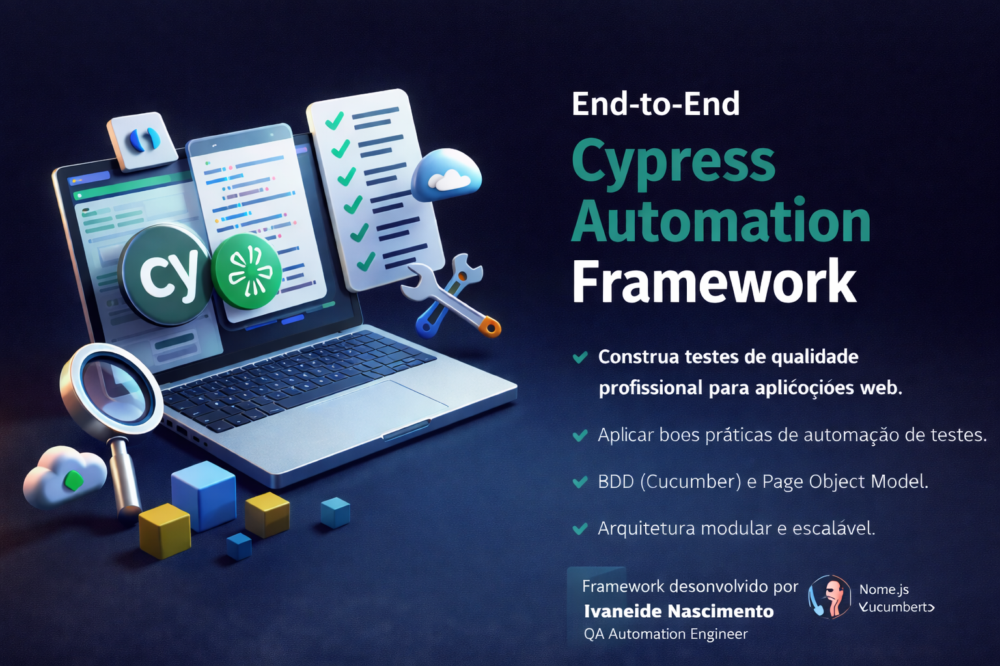

<p align="center">
  
</p>

<h1 align="center">🧪 QA Automation Cypress Framework</h1>

<p align="center">


</p>

<p align="center">
Professional and scalable <b>QA Automation Framework</b> built with <b>Cypress</b>, using <b>BDD (Cucumber)</b> and <b>Page Object Model (POM)</b>.
</p>

<p align="center">
Created by <b>Ivaneide Monteiro</b>
</p>

---

# 🎯 Project Objective

This project demonstrates how to build a **production-ready QA automation framework** following industry best practices.

The framework simulates a **real QA automation project**, focusing on:

- scalability
- maintainability
- CI/CD integration

It includes:

- ✅ End-to-End (E2E) automation  
- ✅ BDD test scenarios using Cucumber  
- ✅ Page Object Model architecture  
- ✅ Modular and scalable test structure  
- ✅ Real UI testing using SauceDemo  
- ✅ Git version control  
- ✅ CI/CD ready structure  

---

# 🧪 Automated Test Scenarios

## 🔐 Login Module

The following login flows were automated:

| Scenario | Description |
|--------|-------------|
| Login success | Valid user logs into the system |
| Invalid password | Error message validation |
| Locked user | System blocks login |

---

## 🛒 Cart Module

Cart automation validates:

| Scenario | Description |
|--------|-------------|
| Add product to cart | User adds item to shopping cart |

---

# 🏗 Architecture & Design Principles

This framework was designed to ensure:

- 🔹 Scalability
- 🔹 Maintainability
- 🔹 Clean architecture
- 🔹 Separation of concerns
- 🔹 Reusable Page Objects
- 🔹 Readable BDD scenarios

The architecture separates responsibilities between:

- Test scenarios
- Step definitions
- Page objects
- Configuration
- Support commands

---

# 🛠 Tech Stack

This framework was built using modern QA automation tools:

- Cypress
- Cucumber (BDD)
- JavaScript (ES6)
- Node.js
- Page Object Model (POM)
- Git
- GitHub
- Chrome Headless

---

# 📁 Project Structure

<details>
<summary><b>Click to expand</b></summary>

```bash
qa-automation-cypress-framework/
│
├─ assets/
│  ├─ cypress-qa-framework-banner.png
│  └─ test-run.gif
│
├─ cypress/
│
│  ├─ e2e/
│  │  ├─ login/
│  │  │  └─ login.feature
│  │  └─ cart/
│  │     └─ cart.feature
│
│  ├─ fixtures/
│  │  └─ example.json
│
│  └─ support/
│
│     ├─ pages/
│     │  ├─ LoginPage.js
│     │  └─ InventoryPage.js
│
│     ├─ step_definitions/
│     │  ├─ login.steps.js
│     │  └─ cart.steps.js
│
│     ├─ commands.js
│     └─ e2e.js
│
├─ .gitignore
├─ cypress.config.js
├─ package.json
└─ README.md
```

# ▶️ Running Tests Locally

### Install dependencies

--- npm install

### Run Cypress UI

--- npx cypress open

### Run tests in headless mode

---npx cypress run

### Run specific test

Example:
npx cypress run --spec "cypress/e2e/login/login.feature"
or

---npx cypress run --spec "cypress/e2e/cart/cart.feature"

# 📊 Example Test Result

Example execution result:
✔ Login com sucesso
✔ Login com senha inválida
✔ Login com usuário bloqueado
3 passing (5s)

Carrinho
✔ Adicionar produto ao carrinho

1 passing (4s)

---

## 🎥 Test Execution Example

Example of automated test execution using Cypress.


---

# 🔄 CI/CD Pipeline (Planned)

This framework is structured to support CI/CD pipelines.

Next steps include:

- GitHub Actions integration
- Headless browser execution
- Parallel test execution
- Test artifacts generation
- Automatic test reports


---

# 🚀 Future Improvements

Planned improvements for this project:

- API testing integration
- Parallel execution
- Test reporting dashboard
- Multi-environment configuration
- Test data management
- Visual testing
- Performance testing

---

## 👩‍💻 Author

**Ivaneide Monteiro**

QA Automation Engineer focused on:

- Test Automation
- Quality Engineering
- CI/CD Pipelines
- Scalable testing frameworks

GitHub  
https://github.com/ivaneidepmn

---

⭐ If you like this project

Give it a ⭐ on GitHub to support the work!